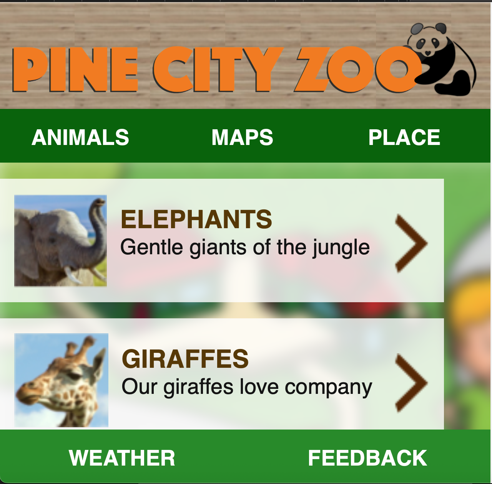

# 🐾 Pine City Zoo App

An interactive and responsive zoo application that helps visitors explore Pine City Zoo effortlessly.  
Built with **HTML**, **CSS**, and **JavaScript**, the app includes a navigable map and detailed sections showcasing animals and popular attractions within the zoo.

---

## 🧭 Features

- 🗺️ **Interactive Zoo Map**: Navigate through the zoo with a visual map that highlights key locations.
- 🐒 **Animals Section**: Browse through various animals with detailed descriptions and photos.
- 🏞️ **Places Section**: Discover key areas within the zoo, such as picnic spots, cafes, reptile house, etc., each with a short write-up and image.

---

## 📸 Screenshots

### 🗺️ Zoo Navigation Map


---

### 🐘 Animal Showcase



---

### 🏞️ Places in the Zoo


---

## 📂 Tech Stack

- HTML5  
- CSS3  
- JavaScript

---

## 🚀 Getting Started

1. Clone this repo:
   ```bash
   git clone https://github.com/your-username/pine-city-zoo-app.git
